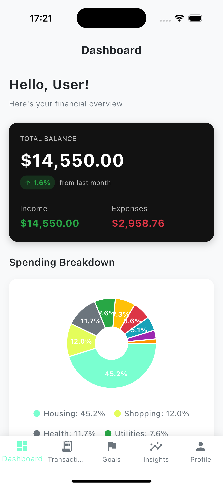
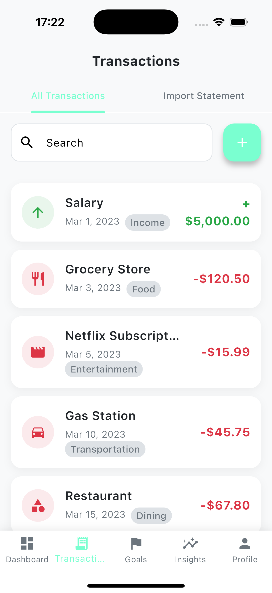
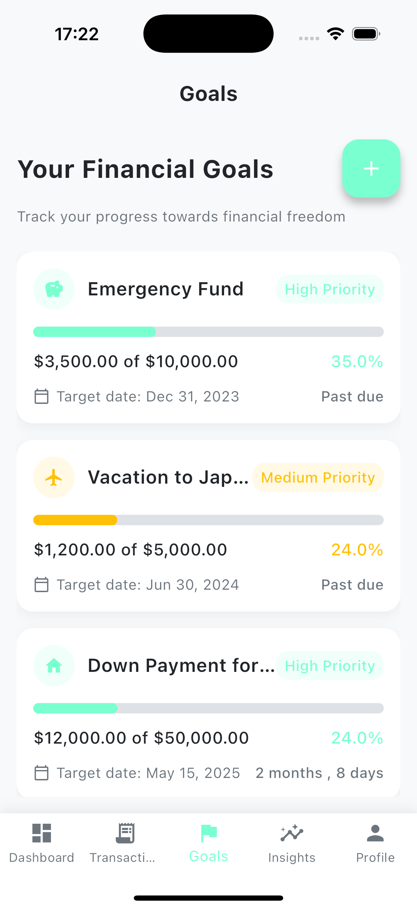

# WizzCash - Modern Financial Management App

<div align="center">
  <h1>💰 WizzCash</h1>
  <h3>Your Personal Finance Assistant with AI-Powered Insights</h3>
</div>

<p align="center">
  <a href="#features">Features</a> •
  <a href="#screenshots">Screenshots</a> •
  <a href="#technical-details">Technical Details</a> •
  <a href="#privacy-first">Privacy First</a> •
  <a href="#getting-started">Getting Started</a> •
  <a href="#future-enhancements">Future Enhancements</a>
</p>

---

## 📱 Overview

WizzCash is a cross-platform mobile application that empowers users to take control of their finances through intuitive management tools and AI-driven insights. What sets WizzCash apart is its commitment to privacy—all data processing happens locally on the user's device, ensuring sensitive financial information never leaves your phone.

## ✨ Features

### Core Functionality

- **📊 Financial Dashboard**: Get an at-a-glance view of your finances with total balance, income vs. expenses, and spending breakdowns
- **💰 Transaction Management**: Easily add, edit, and categorize transactions 
- **📄 Bank Statement Import**: Upload PDF bank statements to automatically extract and categorize transactions
- **🎯 Goal Tracking**: Set and monitor progress towards financial goals with visual indicators
- **🧠 AI-Driven Insights**: Receive personalized recommendations based on your spending patterns
- **📈 Spending Analysis**: Visualize your spending habits with interactive charts and category breakdowns
- **📝 Budget Management**: Set limits for different spending categories and track your adherence

### User Experience

- **🚀 Streamlined Onboarding**: Quick and skippable setup process to get started in seconds
- **🔍 Smart Search**: Easily find transactions by description, category, or amount
- **📱 Cross-Platform**: Works seamlessly on iOS and Android devices
- **🔒 Secure by Design**: No account required, all data stays on your device

## 📷 Screenshots

<div align="center">
  <table>
    <tr>
      <td align="center"><br /><b>Financial Dashboard</b></td>
      <td align="center"><br /><b>Transaction Management</b></td>
      <td align="center"><br /><b>Financial Goals</b></td>
    </tr>
  </table>
</div>

## App Highlights

### Dashboard
Clean dashboard with financial overview showing balance, income, expenses, and spending breakdown by category. The pie chart visualization helps you understand where your money is going at a glance.

### Transactions
Easily view, add, edit, and search through your transactions. The app supports both manual entry and automated import from bank statements using our PDF import feature.

### Financial Goals
Set and track your financial goals with visual progress indicators, target dates, and priority settings. Goals like "Emergency Fund," "Vacation," or "Down Payment" can be monitored over time.

## 🛠 Technical Details

### App Architecture

WizzCash is built with modern development principles:

- **Flutter Framework**: Enables smooth cross-platform performance with a single codebase
- **Provider Pattern**: Clean, reactive state management throughout the app
- **Repository Pattern**: Separation of concerns between data sources and business logic
- **Modular Design**: Components are organized for maintainability and testability

### Technology Stack

```yaml
# Core Technologies
Framework: Flutter 3.7+
Language: Dart 3.0+
State Management: Provider
Database: SQLite with SQFLite

# Key Packages
UI Components: fl_chart, percent_indicator
File Handling: file_picker, path_provider
Data Security: flutter_secure_storage, encrypt
Data Formatting: intl
PDF Processing: pdf (with mock OCR)
```

### Data Structure

- **User Profile**: Stores user information, preferences, and budget settings
- **Transactions**: Records of financial activities with categories and metadata
- **Financial Goals**: Target amounts, deadlines, and progress tracking
- **Budget Limits**: Category-specific spending caps and usage metrics

## 🔒 Privacy First

WizzCash takes a fundamentally different approach to your financial data:

- **No Cloud Storage**: All data remains on your device—no accounts, no servers
- **Local Processing**: PDF parsing, transaction analysis, and recommendations happen on-device
- **No Network Requests**: The app functions entirely offline (except for optional updates)
- **Device-Level Security**: Takes advantage of modern mobile security features

## 🚀 Getting Started

### Prerequisites

- Flutter SDK (version 3.7.0 or higher)
- Dart SDK (version 3.0.0 or higher)
- Android Studio / Xcode for running on emulators or physical devices

### Installation

1. Clone the repository
```bash
git clone https://github.com/yourusername/wizzcash.git
```

2. Navigate to the project directory
```bash
cd wizzcash
```

3. Install dependencies
```bash
flutter pub get
```

4. Run the app
```bash
flutter run
```

## Development Setup

For developers looking to contribute or customize the app:

```bash
# Run tests
flutter test

# Format code
flutter format lib/

# Analyze project
flutter analyze
```

## 🔮 Future Enhancements

WizzCash is continuously evolving, with plans to add:

- **Advanced OCR**: Improved bank statement parsing with machine learning
- **Recurring Transactions**: Smart detection and management of regular payments
- **Expense Forecasting**: AI-powered predictions of future spending
- **Investment Tracking**: Monitor portfolio performance alongside regular finances
- **Dark Mode**: Enhanced visual options for different preferences
- **Biometric Security**: Additional layer of protection for sensitive data
- **Data Export**: Flexible options to export your financial data
- **Encrypted Backup**: Optional secure backup to local storage

## 📋 Project Structure

```
lib/
├── main.dart               # App entry point
├── models/                 # Data models
│   ├── transaction.dart    # Transaction model
│   ├── goal.dart           # Financial goal model
│   └── user_profile.dart   # User profile settings
├── providers/              # State management
│   └── financial_data_provider.dart # Central data provider
├── screens/                # UI screens
│   ├── dashboard_screen.dart     # Main overview
│   ├── transactions_screen.dart  # Transaction management
│   ├── goals_screen.dart         # Financial goals
│   └── insights_screen.dart      # AI recommendations
├── services/               # Business logic
│   ├── database_service.dart     # Local data storage
│   ├── analytics_service.dart    # Financial analysis
│   └── pdf_parser_service.dart   # PDF import functionality
├── utils/                  # Utilities and helpers
│   ├── app_theme.dart           # UI theme constants
│   └── formatters.dart           # Data formatting utilities
└── widgets/                # Reusable UI components
    ├── transaction_card.dart    # Transaction display
    ├── goal_card.dart           # Goal progress card
    └── spending_chart.dart      # Data visualization
```

## 📝 License

This project is licensed under the MIT License - see the LICENSE file for details.

## 👏 Acknowledgments

- Design inspiration from modern financial applications
- Open-source Flutter community for amazing packages
- Mock data generated for demonstration purposes

---

<p align="center">
  <sub>Built with ❤️ for better financial management</sub>
</p>
